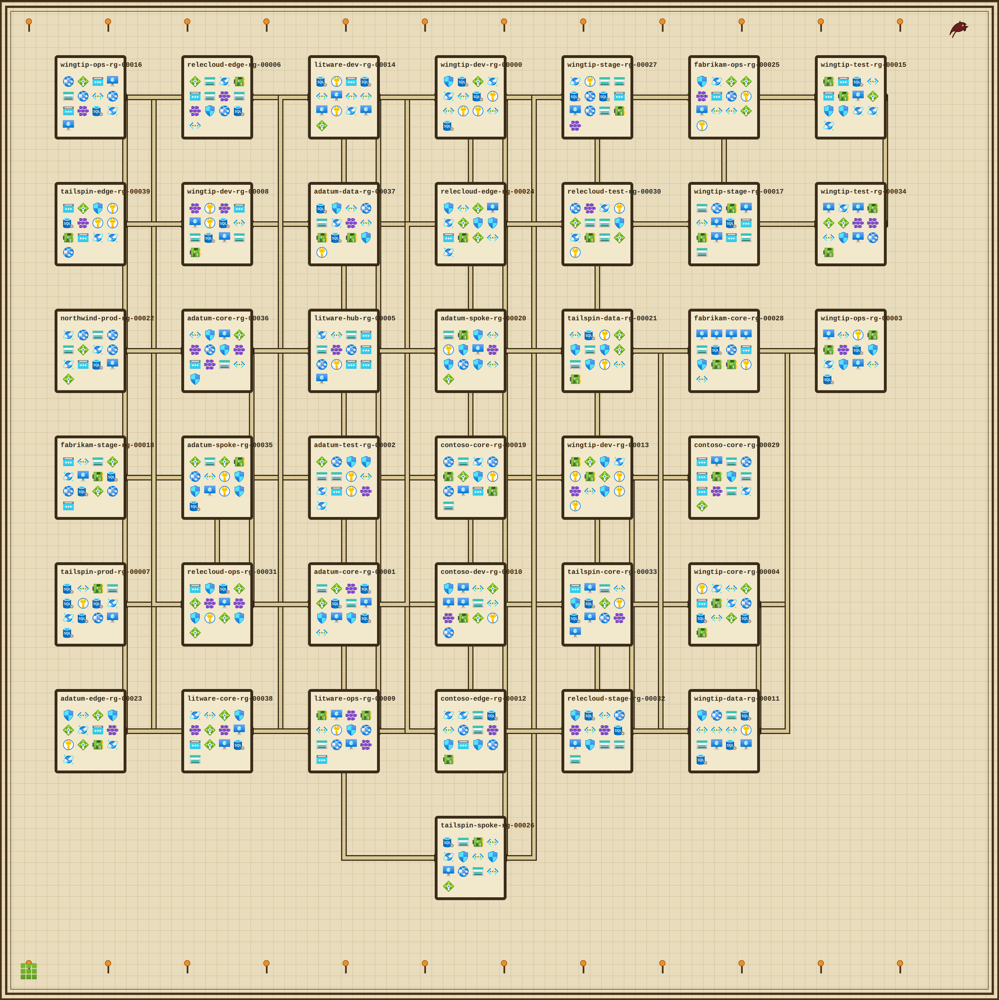
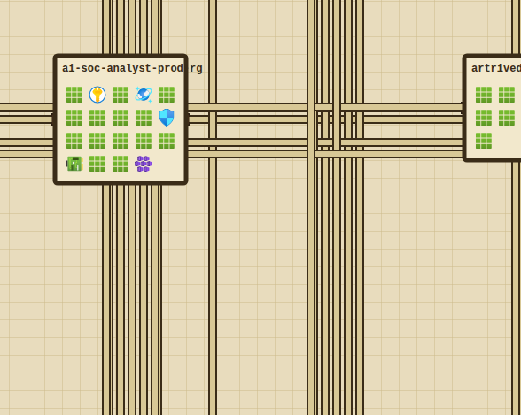
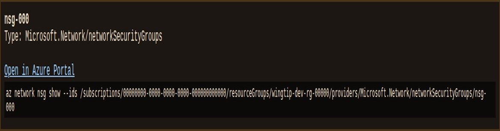

# AzZork 🧙‍♂️☁️

**The Azure control plane, reimagined as a Zork-style text adventure.**

AzZork turns cloud governance into a dungeon crawl. Your Azure subscription is
the dungeon; **resource groups are rooms**, **resources are objects and
creatures**, **RBAC gates the deeper doors**, and the classic Zork **Grue**
lurks wherever you forget to turn on the lights — that is, in any *unmonitored*
resource group. Governance hazards (public endpoints, unencrypted data, runaway
cost, unlocked resources, dark rooms) are what breed Grues. Harden the estate,
banish the Grues, and raise your governance score.

> It is pitch black. You are likely to be eaten by a Grue.

## The metaphor

| Adventure concept        | Azure concept                                   |
| ------------------------ | ----------------------------------------------- |
| Room                     | Resource group (pinned to a region)             |
| Object / creature        | Resource (VM, storage account, key vault, ...)  |
| Exits (n/s/e/w/u/d)      | Navigation across resource groups / regions     |
| Dark room                | Resource group with **no monitoring**           |
| **Grue**                 | Danger: cost overrun, public/unencrypted, unmonitored |
| `look` / `examine`       | `az resource list` / `az resource show`         |
| `take` / `drop`          | Acquire / delete a resource (with confirmation) |
| `lock` / `unlock`        | Add / remove a management lock (+ private + encrypted) |
| `resize`                 | Right-size a resource to cut runaway cost       |
| `monitor`                | Enable diagnostics / Azure Monitor (banish Grue)|
| `cast deploy`            | `az deployment group create` (bicep/ARM, mock)  |
| `score`                  | Governance posture (0–100)                       |

## Verbs (mapped to `az` operations)

```
look / l                describe the current resource group (list resources)
examine <name> / x      inspect a resource (az resource show)
go <dir> | <dir>        navigate: north south east west up down (n/s/e/w/u/d)
take <name>             acquire a resource into inventory (with confirmation)
drop <name>             delete a resource (destructive, with confirmation)
lock <name>             secure a resource: lock + private + encrypted
unlock <name>           remove a management lock (so it can change/delete)
resize <name>           right-size a resource to cut runaway monthly cost
monitor / light         enable monitoring here (banish the Grue)
cast deploy [template]  cast a deployment spell (bicep/ARM, mock)
inventory / i           list resources you are carrying
score                   report your governance posture (0-100)
learn <group>           introspect 'az <group> --help' and grow AzZork at runtime
capabilities / caps     list the az capabilities AzZork has learned so far
recall <query>          ranked recall over AzZork's persistent graph memory
friction <note>         record something confusing/missing to improve later
memory / mem            summarise what AzZork remembers (rooms, objects, verbs)
help / ?                show this help
version / ver           show the AzZork version
quit / q                leave the dungeon
```

AzZork does **not** ship a frozen, hand-maintained table of `az` commands.
Instead it *derives* its vocabulary from the real CLI and grows as you play:

- **`learn <group>`** runs `az <group> --help`, parses the command list, and folds
  every discovered command into AzZork's [`CapabilityRegistry`] as a new verb.
  No code edit is needed for AzZork to understand a new `az` command — it is
  learned, not compiled in.
- **Persistence.** Learned capabilities are cached (default
  `~/.local/share/azork/capabilities.tsv`, override with `AZORK_CACHE_DIR`) and
  **recalled on the next launch**, so AzZork accumulates knowledge across
  sessions.
- **Adaptive help.** `help` and `capabilities` surface everything learned so far,
  grouped by `az` command group.
- **Intent resolution, never a dead end.** Input that matches no built-in verb is
  routed through an agentic [`IntentResolver`]. Its default, fully-offline
  `MockAdapter` ranks your words against learned capabilities and answers with a
  confident match or a "did you mean…" list — AzZork *tries to figure out what
  you meant* rather than failing. The `Adapter` trait is the seam where a richer,
  live agentic resolver (recipe-runner style) can be slotted in.

All CLI access flows through a single `AzRunner` seam, so the entire
self-evolution machinery is exercised offline in tests with canned `az` output —
`cargo test` never calls the real `az` binary or the network.

[`CapabilityRegistry`]: src/capabilities/registry.rs
[`IntentResolver`]: src/agent/mod.rs

## Graph memory 🧠

AzZork carries a persistent, ladybug-style **graph memory** — a lightweight
cognitive-memory model of typed memory nodes with ranked recall — that
accumulates across sessions:

- **Rooms** (resource groups), **objects** (resources), **verbs** (learned az
  capabilities), **intents** (free-text you typed), and **friction** notes are
  all remembered as typed nodes.
- Memory is saved to `~/.local/share/azork/memory.graph` (override the directory
  with `AZORK_CACHE_DIR`) and **recalled on the next launch** — the banner shows
  `[memory: recalled N remembered nodes ...]`.
- **`recall <query>`** does a ranked recall across everything remembered.
- **`memory`** summarises counts by kind plus recent notes.
- **`friction <note>`** records anything confusing or missing so it can be fixed
  later; unresolved intents are auto-recorded as friction too.

The default memory is a fully in-memory/offline `GraphMemory` store (deterministic,
line-based persistence, zero deps) so `cargo build`/`cargo test` stay light and
green. Durable, SQLite-backed persistence over the native `amplihack-memory`
library is available as an **opt-in companion crate**,
[`memory-store/`](memory-store/): it mirrors the whole graph (nodes **and** edges)
into an `amplihack-memory` store, reloads it faithfully across sessions, and offers
full-text ranked recall through the library's own search engine. Unlike the
`agent_engine` module (below), it is kept out of the azork package so
the default build never links a native dependency — see
[`memory-store/README.md`](memory-store/README.md).

## Agentic intent resolution

The [`src/agent_engine/`](src/agent_engine/) module depends on and drives the
MIT-licensed [`recipe-runner-rs`] engine — it does not embed AzZork into the
runner, it implements the runner's `Adapter` trait (`AzorkAdapter`) so AzZork
can act as the agent the runner calls: *agent* steps resolve intent against
the learned registry (deterministic, offline at runtime), *bash* steps
delegate to the runner's CLI subprocess adapter so a recipe can shell out to
`az`. `run_intent_recipe` hands an inline amplihack recipe to the runner with
AzZork as the agent.

It is part of the **main azork crate**: `recipe-runner-rs` is a normal git
dependency, pinned to a specific upstream commit for reproducibility, so
`cargo build`/`cargo test` at the repo root compile and exercise this
capability **by default** — no separate crate to build and no reference repos
to check out side-by-side.

[`recipe-runner-rs`]: https://github.com/rysweet/amplihack-recipe-runner

## Install

Requires a Rust toolchain (`cargo`). Then:

```bash
git clone https://github.com/rysweet/azork.git
cd azork
cargo build --release
# binary at target/release/azork
```

Run it directly during development:

```bash
cargo run
```

### Keeping it up to date

AzZork can update itself from GitHub Releases:

```bash
azork update            # download & install the latest release, if newer
azork update --check    # only report whether an update is available
```

It also performs a cheap, cached update check at startup that is fully
opt-out and safe under CI / non-interactive use:

```bash
export AZORK_NO_UPDATE_CHECK=1   # disable the automatic startup check
```

Updates are verified by SHA-256 before install and the check is skipped
automatically under CI, non-TTY, or subprocess invocation, so it never hangs or
prompts in automation. See the [Self-Update guide](docs/UPDATING.md) for the
full trust model, exit codes, and release flow.

## Usage

### Offline mock backend (default — no Azure credentials needed)

```bash
azork
# or
cargo run
```

This loads a small synthetic Azure estate (subscriptions, resource groups and
resources) so the game runs anywhere with **zero credentials and no network**.

### Real backend (optional — shells out to the `az` CLI)

Explore your *actual* subscription. Requires the [Azure CLI](https://learn.microsoft.com/cli/azure/)
installed and logged in (`az login`):

```bash
azork --backend az
# or
AZORK_BACKEND=az azork
```

The real backend maps your live resource groups into rooms and their resources
into objects by shelling out to `az group list` / `az resource list`. It never
runs by default and is never exercised by the test suite.

On large tenants the live backend is **bounded** so it never fans out into
hundreds of sequential `az resource list` calls:

- `AZORK_MAX_ROOMS` — max resource groups mapped into rooms (default 40).
- `AZORK_MAX_RESOURCE_ROOMS` — max rooms whose resources are enumerated (default 8).

Rooms beyond the cap are still navigable; their contents are lazily summarised.

> ⚠️ The real backend performs **read-only** discovery. Destructive verbs in the
> game (`drop`) operate on the in-memory world model only — AzZork does not
> delete real Azure resources.


## Dungeon Crawler Mode 🗺️

Prefer a map to a REPL? `azork crawl` (alias `azork dungeon`) turns your whole
subscription into a single explorable, hand-drawn-style dungeon map instead of
one resource group at a time: resource groups become rooms, resources become
icons on the floor, and shared regions/relationships become corridors.

```bash
azork crawl --backend az --serve
```

```
🗺  Mapping subscription "Contoso-Prod" ...
    Discovered 14 resource groups, 87 resources.
🕯  Dungeon assembled. Serving map at http://127.0.0.1:53214
```

Open the printed URL and click any room to pop up its contents: each resource
shows its icon, a deep link straight to that resource's page in the Azure
portal, and one or more suggested read-only `az` commands to inspect it
(display-only — nothing is ever executed for you).

Here's a real map generated by `azork crawl` against a live subscription (257
rooms, 2,859 resources):


*The full dungeon: every resource group is a room, every resource an icon, and
corridors connect resource groups that share regions or relationships.*


*Zoomed in: room labels are the resource-group names, and the icons inside each
room are coded by resource type (e.g. `SA` storage account, `VN` virtual
network, `VM` virtual machine, `KV` key vault, `CD` Cosmos DB).*


*Clicking a resource icon pops up its name, type, an "Open in Azure Portal"
link, and a suggested read-only `az` command to inspect it.*

It is **strictly read-only** (only `list`/`show`-class `az` calls), uses the
same `AzRunner` seam as the rest of AzZork, validates resource IDs before
building deep links or command suggestions, scrubs secret-shaped text from the
rendered output, and binds its local server to loopback only. Full details:
[docs/DUNGEON-CRAWLER.md](docs/DUNGEON-CRAWLER.md).

## Azure CLI extension (`az azork`) — optional

AzZork also ships as an **Azure CLI extension** so you can play from `az`:

```bash
cd azext && python3 setup.py bdist_wheel
az extension add --source azext/dist/azork-0.2.0-py3-none-any.whl --yes
az azork run --commands "look; score"
az azork play --backend az
```

The extension (`azext_azork`) is a thin Python shim that shells out to the
compiled `azork` binary (found via `AZORK_BIN`, a bundled `bin/azork`, or `PATH`).
See [`azext/README.md`](azext/README.md) for details.

## Example session

```
    ___    ______           __
   /   |  ____/ / __ \_____/ /__
  / /| | /_  / / / / / ___/ //_/
 / ___ |/ /_/ / /_/ / /  / ,<
/_/  |_|\____/\____/_/  /_/|_|

AzZork — an Azure Control-Plane Adventure
=========================================
[backend: mock (offline) | subscription: Contoso-Dev (mock)]

== landing-rg (eastus) ==
The West Landing Zone. Cables snake overhead and a subscription portal hums softly.
You see:
  - portal (Microsoft.Portal/dashboards)
Exits: down, east, north

az> north
== web-rg (eastus) ==
The Public Web Tier. Wind howls through open ports.
You see:
  - appservice (Microsoft.Web/sites)
  - webstore (Microsoft.Storage/storageAccounts)
Exits: north, south

az> examine webstore
webstore [Microsoft.Storage/storageAccounts]
A storage account with its container door flung wide open.
Status: PUBLIC | UNENCRYPTED | unlocked | ~$60/mo
A Grue senses it is exposed to the public internet, storing its data unencrypted, ...

az> lock webstore
You ward the webstore with a management lock, private endpoints, and encryption. A Grue recoils.

az> north
== unmon-rg (centralus) ==
It is pitch black here — no monitoring, no diagnostics. You are likely to be eaten by a Grue.
Exits: south

>> It is dark. You hear the slavering fangs of a Grue nearby. Enable monitoring (type 'monitor') before it strikes!

az> monitor
You enable diagnostic settings and Azure Monitor. Light floods the room; the lurking Grue shrieks and flees.

az> score
Governance posture: 50/100  —  rank: Apprentice Admin
Outstanding hazards: 10 (public/unencrypted/unlocked resources, cost overruns, unmonitored rooms)
Moves taken: 4
```

### Getting eaten by a Grue

Linger in a dark (unmonitored) room and act turn after turn without enabling
monitoring, and the Grue will eventually strike:

```
az> look

>> It is dark. You hear the slavering fangs of a Grue nearby. ...
az> look

>> Oh no! You have walked too long in the dark. A GRUE lunges from the shadows and DEVOURS you.

*** You have died. ***
```

## Development

```bash
cargo build      # compile (default: includes the embedded agent_engine module)
cargo test       # run the unit test suite (parser + world model + backends + memory + agent_engine)
cargo run        # play with the offline mock backend
cargo clippy --all-targets   # lints (CI enforces -D warnings)

cargo build --bin azork-oit          # the live outside-in-testing agent
(cd memory-store && cargo test)      # opt-in amplihack-memory durable-memory crate
```

`azork-oit` (`src/bin/azork-oit.rs`) is an internal self-testing tool: it drives
AzZork like a real user against a live subscription to surface friction and
feed fixes back into the project. It is not a player-facing feature — see
[docs/oit-friction-report.md](docs/oit-friction-report.md) for its latest findings.

## Documentation

Full documentation lives in [`docs/`](docs/):

- [Usage guide](docs/USAGE.md) — every command, the Grue mechanic, and scoring.
- [Tutorial](docs/TUTORIAL.md) — a guided playthrough from first `look` to Cloud Guardian.
- [Configuration reference](docs/CONFIGURATION.md) — backend selection, the mock world, and the read-only `az` backend.
- [Self-Update guide](docs/UPDATING.md) — the `azork update` command, the cached startup check, security/trust model, and release flow.
- [Development guide](docs/DEVELOPMENT.md) — pre-commit hooks, CI, and test coverage.
- [API / module reference](docs/API.md) — internal architecture for contributors.
- [Dungeon Crawler Mode](docs/DUNGEON-CRAWLER.md) — the map view: `azork crawl`, icons, the local server, and interactive room pop-ups.
- [Security policy](SECURITY.md) — threat model, guarantees, and how to report vulnerabilities.
- [Security audit](docs/SECURITY-AUDIT.md) — findings, fixes, and verification results.

## License

[MIT](LICENSE) © 2026 rysweet
