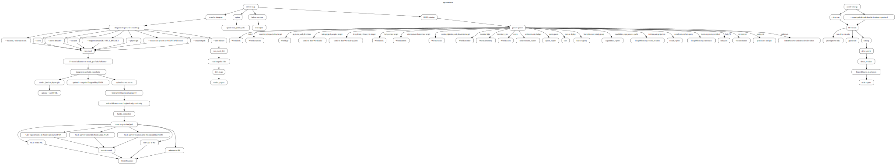

The API contracts layer maps every externally invokable surface found in the Rust code: top-level `azork` CLI paths, crawl/dungeon flags, REPL verbs, the `azork-oit` flags, and the embedded loopback HTTP routes.

| Surface | Entry | Dispatch target | Contract |
|---|---|---|---|
| CLI | `azork crawl` and `azork dungeon` | `dungeon_cli::parse` then `run_crawl` | `CrawlArgs` flags for backend, serve, port, out, budget, playwright, mock-size, snapshot, diff |
| CLI | `azork update [--check]` | `update::run_update_with` | check-only or install path |
| REPL | parser `Command` enum verbs | `handle` in `src/main.rs` | world, capabilities, memory, or intent-resolution operations |
| HTTP | `GET /`, rooms, room detail, resource detail | `server::route` | `RouteResponse` with HTML, JSON DTOs, 404, or 405 |
| OIT | `azork-oit --dry-run --report path` | OIT `main` | runs catalog through `azork` and writes report |
