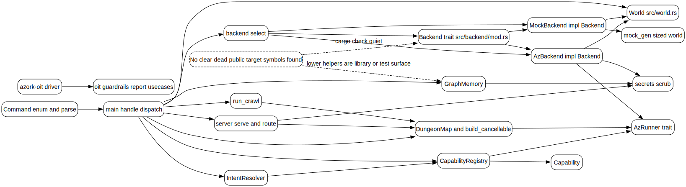

Mode: lsp-assisted

This public symbol map was built from the Rust module declarations, cross-file references, and a quiet `cargo check`; the focused surface covers backend construction, world dispatch, crawler map building, capability learning, and graph memory.

| Symbol surface | Defined in | Referenced by |
| --- | --- | --- |
| `Backend` trait, `select`, `is_recognized` | `src/backend/mod.rs` | `src/main.rs`, backend impls |
| `AzBackend`, `MockBackend` | `src/backend/az.rs`, `src/backend/mock.rs` | backend selector, tests |
| `World` | `src/world.rs` | REPL dispatch, mock and az backends, quests |
| `Command` and `parse` | `src/parser.rs` | `src/main.rs` REPL handler |
| `DungeonMap::build_cancellable`, `serve` | `src/dungeon/map.rs`, `src/dungeon/server.rs` | `azork crawl`, dungeon tests |
| `CapabilityRegistry` | `src/capabilities/registry.rs` | REPL learning, autodiscovery, intent resolver |
| `GraphMemory` | `src/memory/mod.rs` | REPL room, resource, intent, friction memory |
| Dead or unreferenced exports | rg plus `cargo check --quiet` | No clear dead public target symbols found; some lower-level memory methods are library and test surface |
