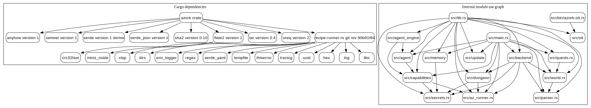

The compile-time dependency view combines `Cargo.toml` direct crates, one notable transitive level from `cargo tree`, and the internal module use graph from Rust `use` statements.

| Area | Evidence | Notes |
| --- | --- | --- |
| Direct Cargo deps | `Cargo.toml` | `anyhow`, `semver`, `serde`, `serde_json`, `sha2`, `flate2`, `tar`, `ureq`, `recipe-runner-rs` |
| Notable transitives | `cargo tree -e normal --depth 2` | `flate2` pulls compression helpers; `recipe-runner-rs` pulls CLI, logging, regex, yaml, tempfile, tracing, uuid helpers |
| Internal graph | `src/lib.rs`, `use crate::...`, `use azork::...` | Main binary fans into backend, parser, world, dungeon, capabilities, memory, update, agent |
| Circular deps | rg module-use scan | No circular internal module dependency found; only expected self-cluster edges inside `src/dungeon` |
