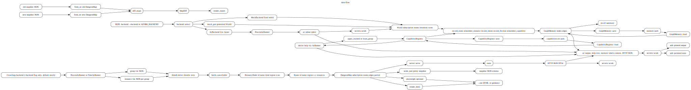

The data-flow layer traces primary read and write paths from live or mock Azure data into `World`, `DungeonMap`, renderers, the loopback HTTP API, snapshots, Time Rift diffs, persistent memory, capability cache, and secret redaction choke points.

| Flow | Source | Transform | Sink |
|---|---|---|---|
| REPL world | mock, generated mock, or live Azure backend | `Backend::build_world` | `World` |
| Dungeon crawl | group/resource JSON from `AzRunner` | `dungeon::map::build_cancellable` | `DungeonMap` |
| Render and serve | `DungeonMap` | renderer or `server::route` | HTML, JSON, or snapshot |
| Time Rift | old and new snapshots | `diff_maps` then `render_report` | text report |
| Memory | intents, rooms, resources, capabilities, friction | `GraphMemory` | line-format `memory.graph` |
| Redaction | Azure output and user-influenced strings | `secrets::scrub` | safe output or persisted state |
