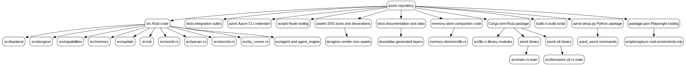

The repository surface centers on the Rust crate in `src/`, with `Cargo.toml` wiring the library plus the `azork` and `azork-oit` binaries; Python and Node tooling live beside it for Azure CLI extension packaging and screenshot capture.

| Area | Code evidence | Role |
| --- | --- | --- |
| Rust package | `Cargo.toml`, `build.rs`, `src/lib.rs` | Core game, crawler, update, memory, agent modules |
| Main binary | `src/main.rs` | REPL plus `crawl`, `dungeon`, and `update` dispatch |
| OIT binary | `src/bin/azork-oit.rs` | Outside-in testing driver |
| Azure CLI extension | `azext/setup.py`, `azext/azext_azork/custom.py` | `az azork` shim over the Rust binary |
| Node tooling | `package.json`, `scripts/capture-real-screenshots.mjs` | Playwright screenshot workflow |
