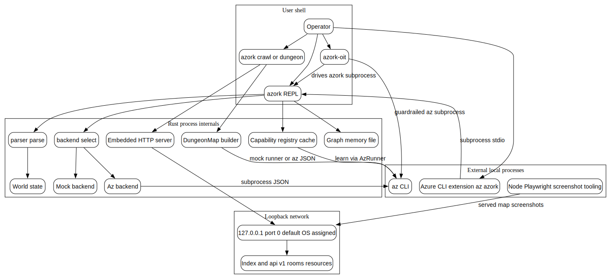

The runtime topology is local-process oriented: the REPL and crawler run as Rust binaries, optional live mode shells out to `az`, and the crawler server binds loopback only with default port `0` so the OS assigns the actual port.

| Runtime path | Evidence | Protocol or port |
| --- | --- | --- |
| `azork` REPL | `src/main.rs` | stdin/stdout, parser to `World` dispatch |
| Live backend and learning | `src/backend/az.rs`, `src/capabilities/*` | subprocess calls to `az`, JSON/help text parsing |
| `azork crawl` or `azork dungeon` | `src/main.rs`, `src/dungeon/cli.rs`, `src/dungeon/map.rs` | map build through mock runner or `az` JSON |
| Embedded HTTP server | `src/dungeon/server.rs`, `src/dungeon/cli.rs` | `127.0.0.1:<port>`, default `--port 0`; routes `/`, `/api/v1/rooms`, `/api/v1/rooms/<id>`, `/api/v1/resources/<id>` |
| `azork-oit` | `src/bin/azork-oit.rs`, `src/oit/*` | drives `azork` and guardrailed `az` subprocesses |
| Azure CLI extension | `azext/azext_azork/custom.py` | `az azork` shells out to located `azork` binary |
