The service-components layer splits AzZork into subsystem diagrams so each graph stays readable while still showing internal module coupling and the real Rust files that define each boundary.


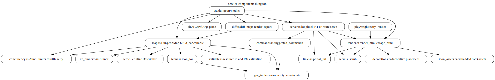


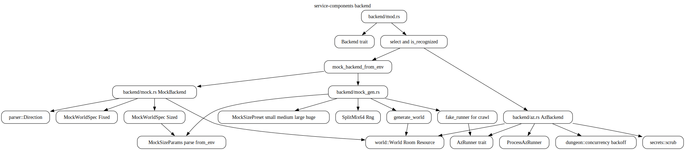


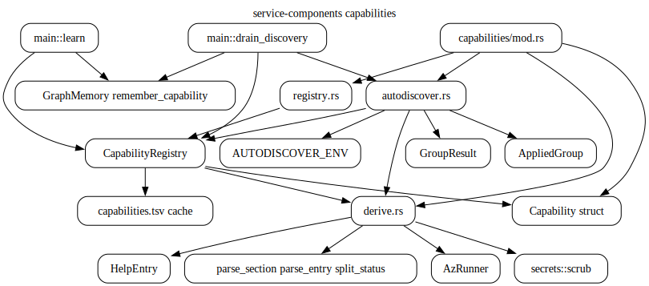


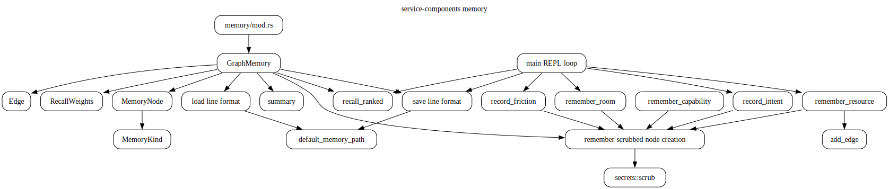


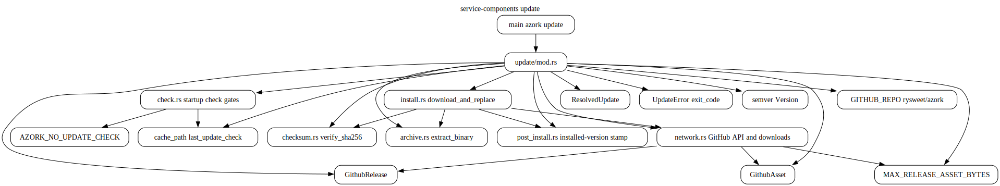


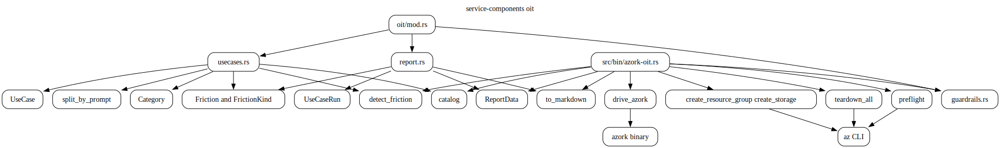


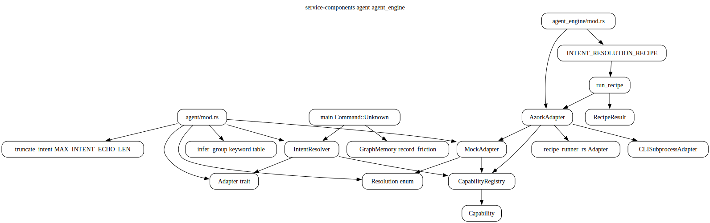

| Subsystem | Primary files | Key coupling |
|---|---|---|
| dungeon | `src/dungeon/*.rs` | map build, render, server, diff, icon/type tables |
| backend | `src/backend/*.rs`, `src/az_runner.rs` | `Backend` trait, live Azure runner, mock estate generation |
| capabilities | `src/capabilities/*.rs` | help parsing, registry persistence, startup autodiscovery |
| memory | `src/memory/mod.rs` | scrubbed graph memory and line-format persistence |
| update | `src/update/*.rs` | release check, download, checksum, archive, install |
| oit | `src/oit/*.rs`, `src/bin/azork-oit.rs` | guardrails, use-case catalog, friction report |
| agent and agent_engine | `src/agent/mod.rs`, `src/agent_engine/mod.rs` | offline intent resolution and recipe-runner adapter |
