The user-journeys layer traces six end-to-end scenarios through real modules and functions, from CLI entry points through parsing, backends, maps, memory, update, OIT, and reporting outputs.

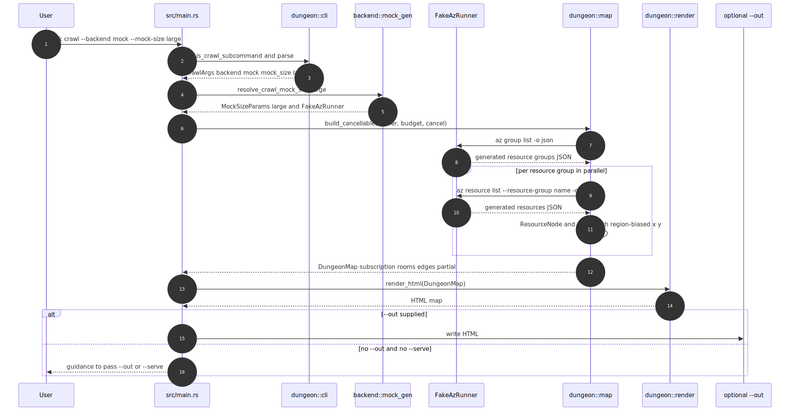

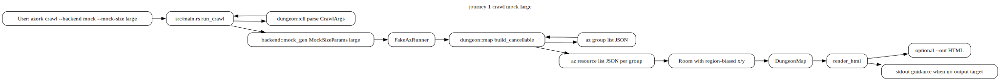

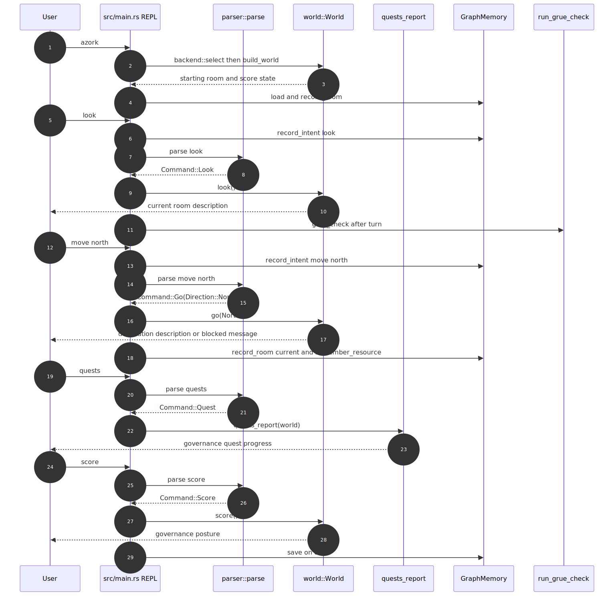

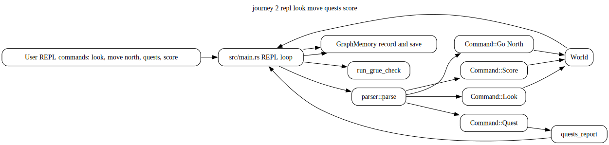

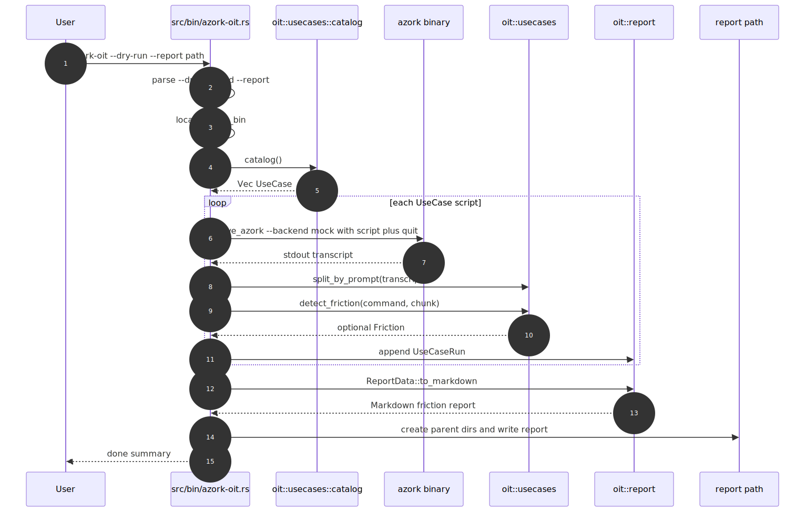

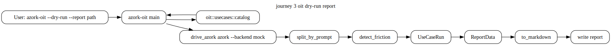

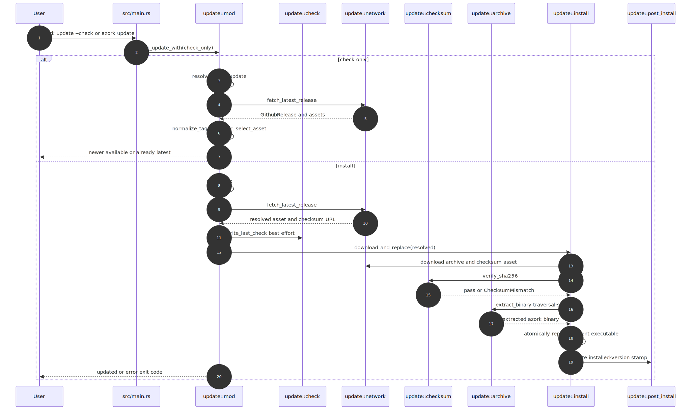

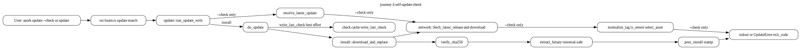

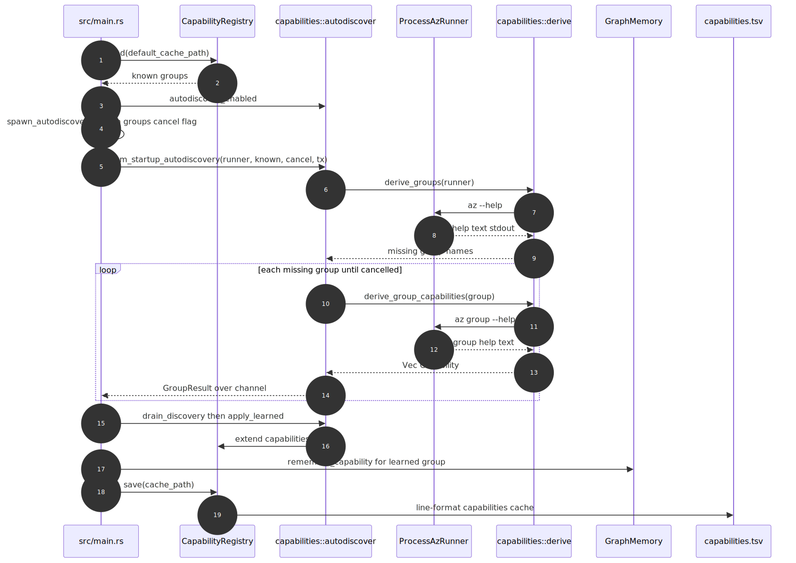

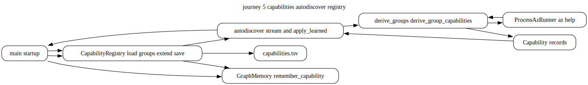

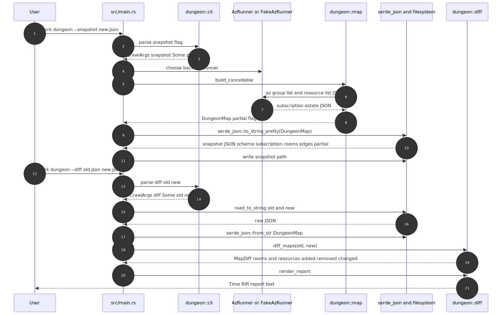

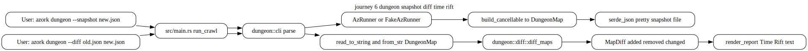

| Journey | Entry | Outcome |
|---|---|---|
| 1 | `azork crawl --backend mock --mock-size large` | `DungeonMap` rendered to HTML or output guidance |
| 2 | REPL `look`, `move`, `quests`, `score` | world navigation and governance output |
| 3 | `azork-oit --dry-run --report path` | Markdown friction report |
| 4 | `azork update --check` or `azork update` | update availability or checked install path |
| 5 | startup autodiscovery | registry and memory updated with learned capabilities |
| 6 | `azork dungeon --snapshot` then `--diff` | snapshot JSON and Time Rift report |
